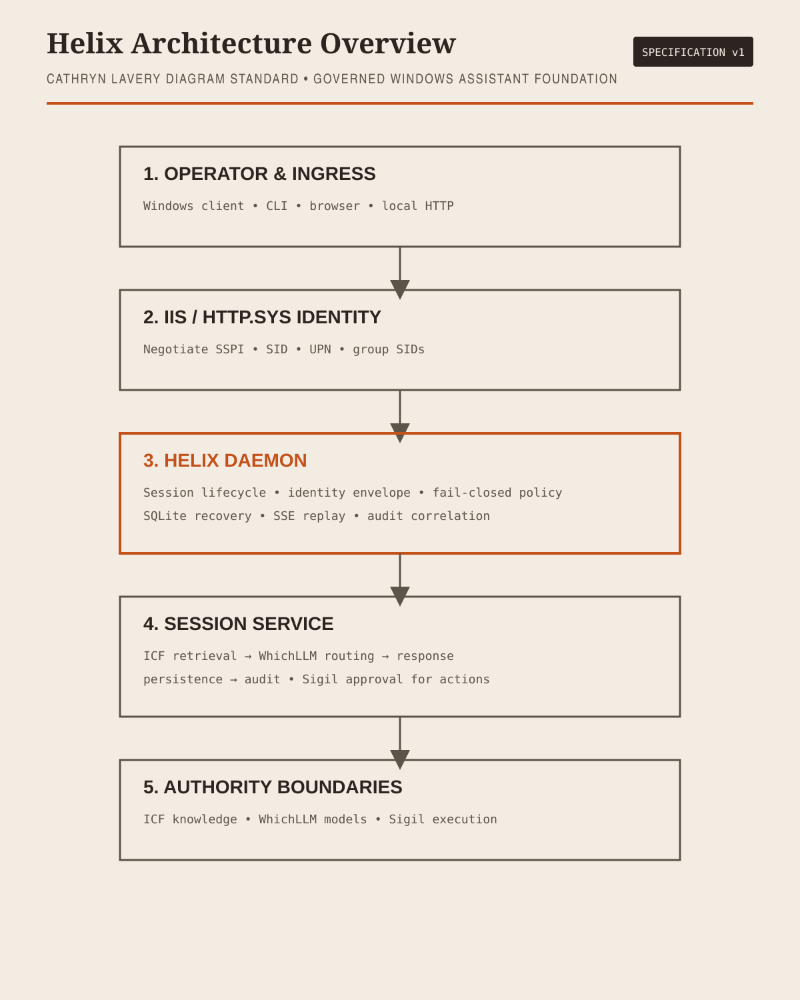

# Helix

Helix is a local Windows personal-assistant foundation for governed engineering work. It provides a durable local daemon, operator-facing CLI/browser surfaces, encrypted ordinary-session persistence, and explicit boundaries to the systems that supply knowledge, model routing, and execution.

## What Helix does

Helix accepts an authenticated operator request, creates a stable session and correlation identity, retrieves relevant governed context, selects an approved model, produces a response, persists ordinary-session results, and records audit events. Governed work remains fail-closed when its authority or evidence boundary is unavailable.

Helix does not own every capability in the system:

- ICF owns knowledge, retrieval, context, lineage, evidence, and governance.
- WhichLLM owns model selection, provider classification, and routing policy.
- Sigil owns capabilities, approvals, execution, and environment interaction.
- Windows IIS/HTTP.sys and the native bridge establish the authenticated operator identity.
- Helix owns the session lifecycle, correlation identity, local persistence boundary, and orchestration between these authorities.

## Architecture`r`n`r`n`r`n`r`n[Open the standalone architecture diagram](docs/diagrams/helix-architecture.html)

```text
Windows operator
      |
IIS / HTTP.sys + Negotiate SSPI
      |
native principal bridge
      |  SID, UPN, groups
Helix daemon
      |-- SessionService
      |     |-- ICF retrieval
      |     |-- WhichLLM routing
      |     |-- response generation
      |     |-- encrypted persistence
      |     `-- audit
      `-- Sigil proposals and receipts
```

Every accepted request carries a Helix-owned identity envelope. The immutable caller anchor is the Windows SID. Authority receipts must match the request correlation ID and SID. Clients, headers, and adapters cannot replace the authenticated identity.

## Current state

Phase 8 foundation work is pushed to `main` and includes strict runtime contracts, SQLite restart recovery, daemon lifecycle routes, SSE replay, native Windows bridge scaffolding, adapter transport and receipt binding, endpoint configuration labels, and packaging validation.

External adapter activation remains fail-closed until approved endpoint, authentication, response, receipt, and deployment evidence is available. The MSIX manifest remains explicitly unsigned until a publisher identity and signing certificate are supplied.

## Run locally

```powershell
npm install
npm run check
npm run package:validate
```

To configure approved adapter locations, provide environment variables without storing credentials in the repository:

```text
HELIX_ICF_RESOLVE_URL
HELIX_SIGIL_EXECUTE_URL
HELIX_WHICHLLM_URL
```

The local daemon binds to loopback by default. Non-loopback binding is rejected by configuration and at daemon construction.

## Documentation

- [Project specification](docs/superpowers/specs/2026-09-10-helix-project-spec.md)
- [Unified foundation design](docs/superpowers/specs/2026-09-10-helix-unified-foundation-design.md)
- [Phase 8 release-readiness design](docs/superpowers/specs/2026-09-10-helix-phase-8-integration-release-readiness-design.md)
- [Contracts index](docs/contracts/README.md)
- [Phase 8 implementation plan](docs/superpowers/plans/helix-phase-8-implementation-plan.md)

## Security and release posture

Helix rejects anonymous or malformed identity input, refuses unsafe network binding, encrypts ordinary persisted records, rejects malformed adapter responses, binds receipts to identity and correlation, and never treats a failed authority call as permission to execute locally.

Local tests and unsigned package validation are development evidence. They are not production approval, signed-release evidence, or clean-machine installation evidence.