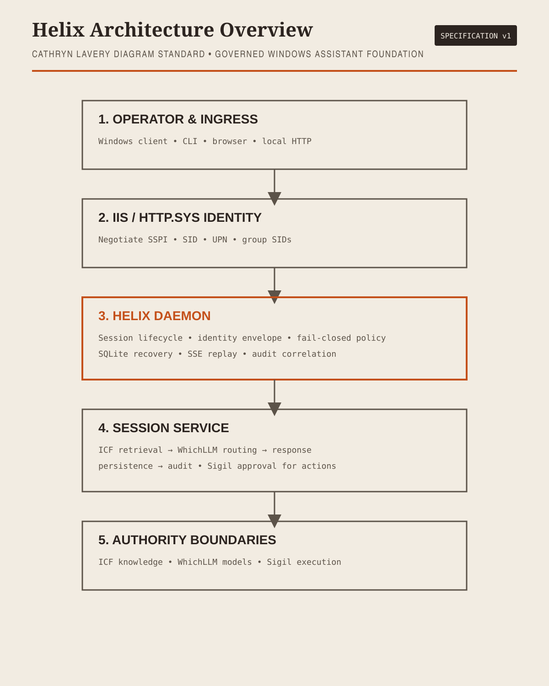

<!--
title: "Helix"
status: active
owner: chris
last-reviewed: 2026-09-27
brand: helix
-->

# Helix

## What Helix is

Helix is a local Windows personal-assistant foundation for governed engineering work. It combines an authenticated local daemon, durable ordinary-session state, explicit model routing, governed retrieval, auditability, and approval-gated execution.

Helix orchestrates these authorities:

- **ICF** — knowledge, retrieval, context, lineage, evidence, and governance.
- **WhichLLM** — model selection and routing policy.
- **Sigil** — capabilities, approvals, execution, and environment interaction.
- **Windows IIS/HTTP.sys** — Negotiate SSPI and authenticated operator identity.

Helix owns session lifecycle, correlation identity, local persistence, and the fail-closed orchestration boundary.

## Architecture

[Open the standalone architecture diagram](helix-architecture.html)

## Start here

- [Repository README](README)
- [Project specification](superpowers/specs/2026-09-10-helix-project-spec.md)
- [Unified foundation design](superpowers/specs/2026-09-10-helix-unified-foundation-design.md)
- [Contracts index](contracts/README)
- [Phase 8 release-readiness design](superpowers/specs/2026-09-10-helix-phase-8-integration-release-readiness-design.md)
- [Phase 8 implementation plan](superpowers/plans/helix-phase-8-implementation-plan.md)

## Security posture

Windows SSPI supplies the operator identity. Helix anchors authorization and receipt binding to the SID, rejects malformed or mismatched identity data, keeps adapter activation fail-closed, and never executes an action without Sigil approval.

## Delivery posture

The Phase 8 foundation is implemented and tested locally. External endpoints, production deployment, signed MSIX, and clean-machine lifecycle evidence remain separate release gates.

Source: [sorensencc-dotcom/helix](https://github.com/sorensencc-dotcom/helix)